# ISP-Connection-Subsystem-Project

This project focuses on developing a platform to streamline the internet connection establishment process between the NTTN (Nationwide Telecommunication Transmission Network), ISP (Internet Service Provider), and end users. Key features include sending connection requests to ISPs and NTTN, accepting requests from ISPs and end users, viewing the active users and ISPs list, and checking the details of ISPs and users. The platform's backend is built using Node.js, with MongoDB serving as the database, and the frontend is developed using React.

For the full project scope and feature list, please refer to the *Scope and Features - Easy Internet Service (Connection).pdf* file.

Instruction for running the backend server: 
- At first set the current working directory to `backend+frontend/backend`.
- Run `npm install` for installing all the dependencies.
- Run `npm start` for starting the server.

Instruction for running the frontend: 
- At first set the current working directory to `backend+frontend/frontend`.
- Run `npm install` for installing all the dependencies.
- Run `npm start` for starting the project on localhost.

This project uses a local MongoDB database. To populate your local database with the necessary data, refer to the instructions provided in the `backup data` folder, which contains all the project data that was used.

To log in as an admin, use the following credentials:

- Username: admin
- Password: admin123

## ERD of this project

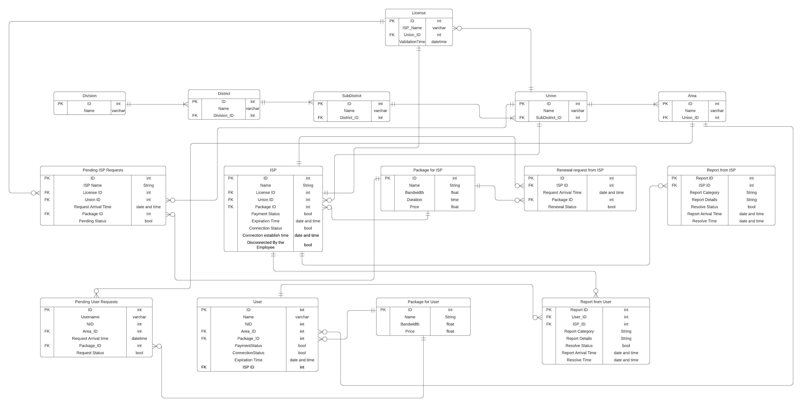

## Partial demo of this project

### Login page

Users can log in as an admin, ISP, or end user. For admin access, use the credentials mentioned above.

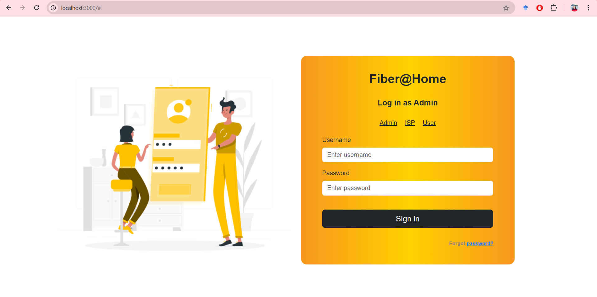

### Admin

After logging in as an admin, the homepage looks like this:

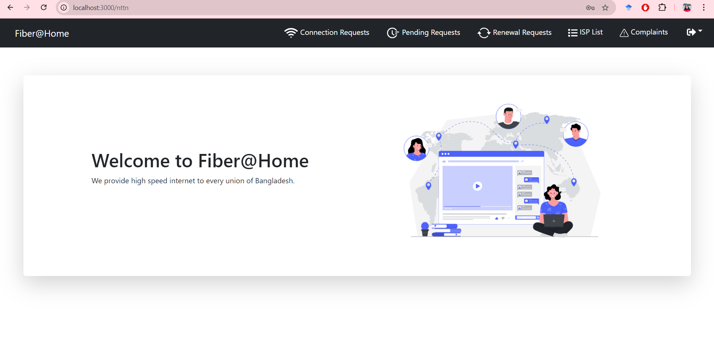

Admin functionalities include viewing connection requests (filterable by time, location, date, keywords, and request type), managing renewal and pending requests, viewing the ISP list, reviewing complaints from ISPs, and logging out.

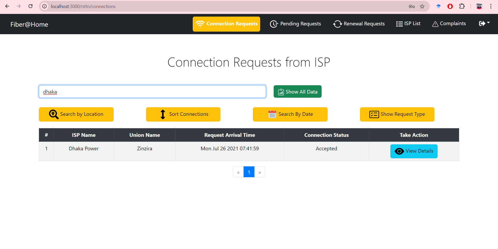

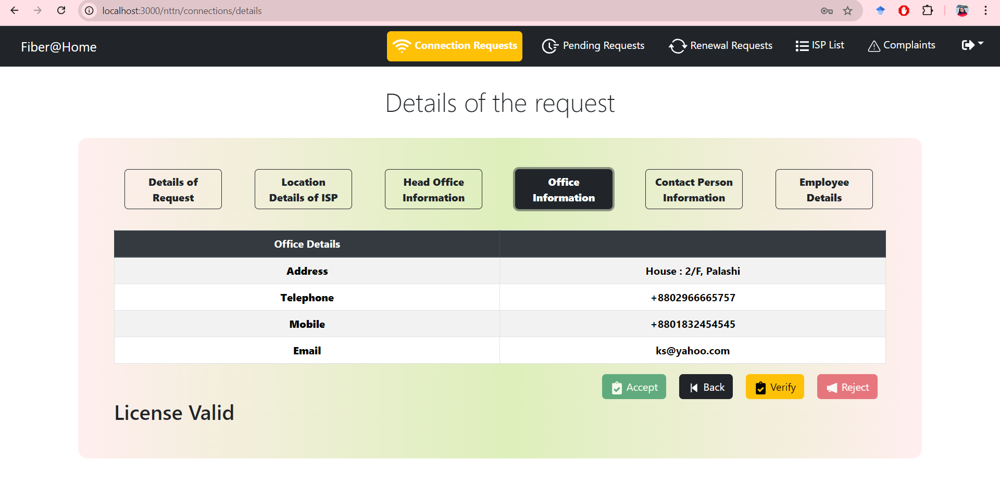

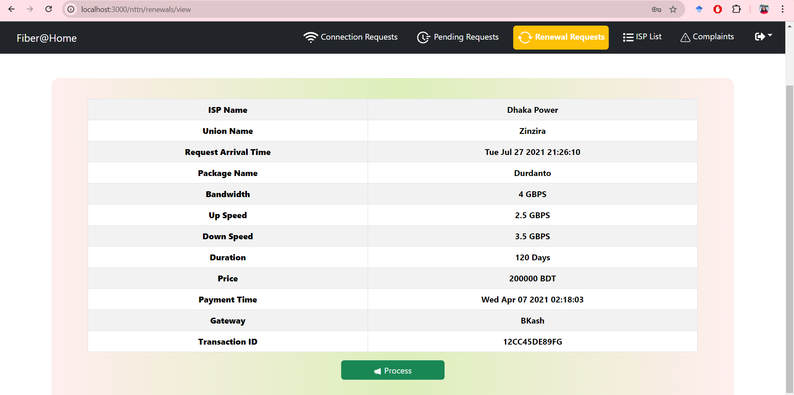

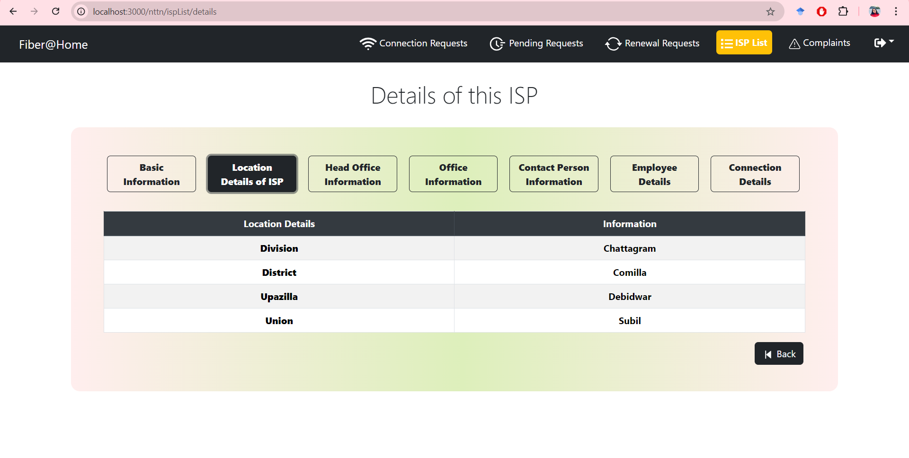

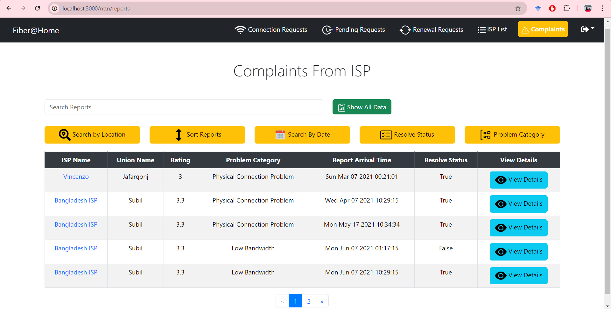

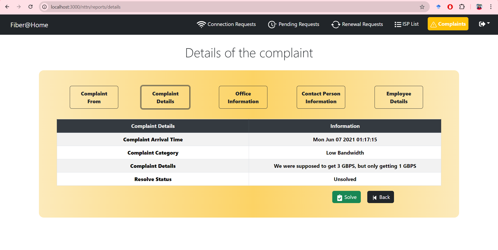

### ISP

After logging in as an ISP, the homepage looks like this:

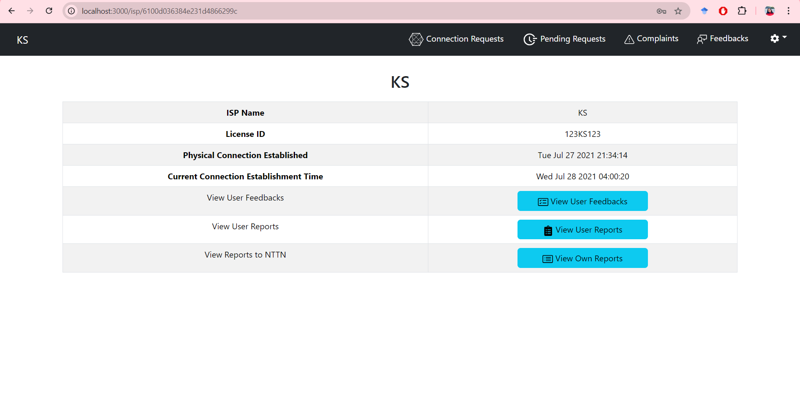

The ISP can view connection requests from users, manage pending requests, handle complaints and feedback from end users, and log out.

### End User

The end user registration page has a simple step-by-step process:

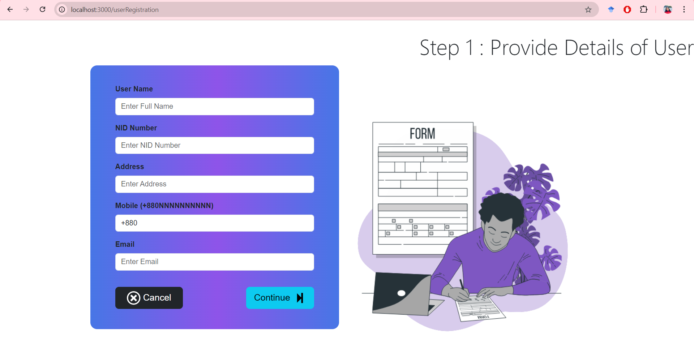

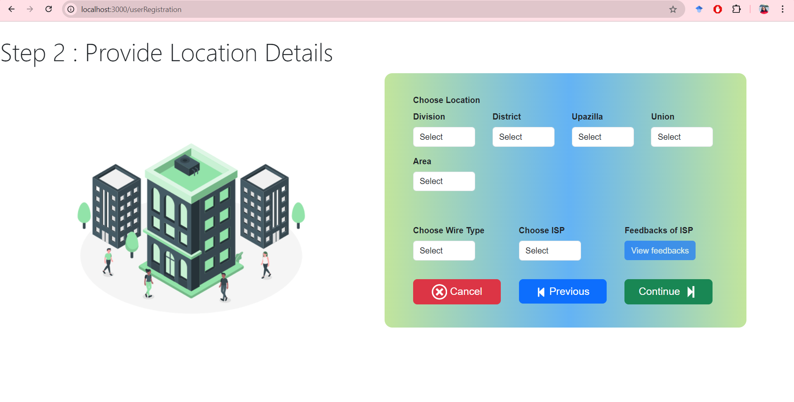

The end user can request for a new connection, report connection problem, and leave feedback for the ISP.

